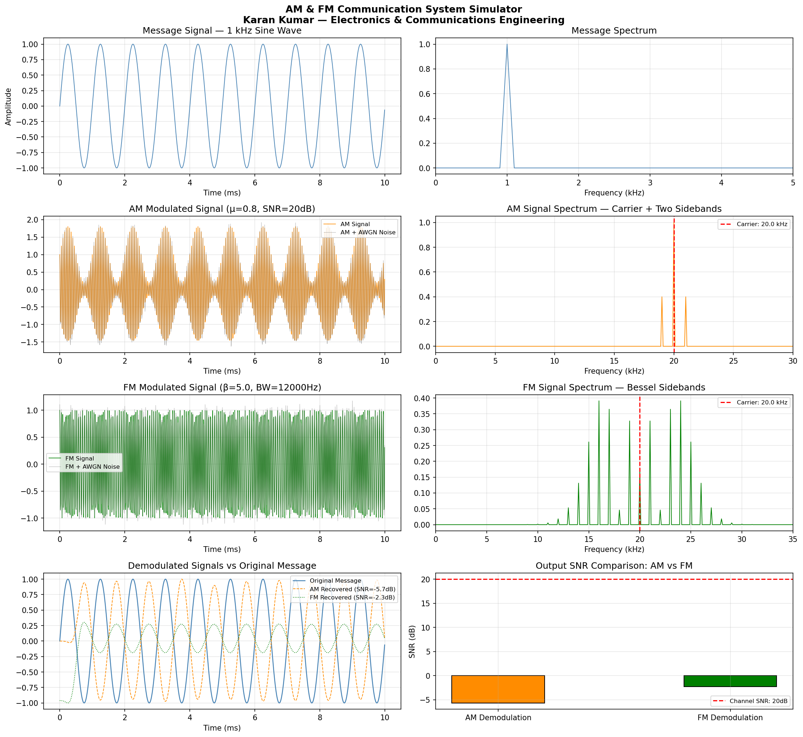

# AM & FM Communication System Simulator
### Analog Communication System with AWGN Channel, Hilbert Demodulation,
### Carson's Rule Bandwidth Analysis and SNR Comparison

## Overview
A complete analog communication system simulator implemented in Python,
modelling the full transmit → channel → receive pipeline for both
Amplitude Modulation (AM) and Frequency Modulation (FM) schemes.
The system simulates a realistic noisy communication channel using
Additive White Gaussian Noise (AWGN), performs demodulation using
signal processing techniques, and quantitatively compares output
SNR performance of AM vs FM.

This project demonstrates core telecommunications engineering concepts
directly aligned with the MSc Electronics and Communications Engineering
curriculum at the University of Siena, Italy.

---

## System Parameters

| Parameter | Value |
|---|---|
| Sampling Frequency | 100 kHz |
| Signal Duration | 10 ms |
| Message Frequency | 1 kHz |
| Carrier Frequency | 20 kHz |
| AM Modulation Index (μ) | 0.8 |
| FM Frequency Deviation (kf) | 5,000 Hz/V |
| FM Modulation Index (β) | 5.0 |
| FM Bandwidth (Carson's Rule) | 12,000 Hz |
| Channel SNR | 20 dB |
| Nyquist Frequency | 50 kHz |

---

## System Architecture
